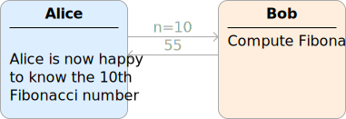
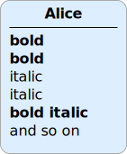
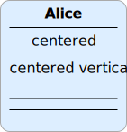
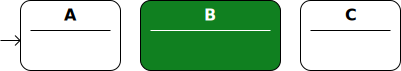

# ProtocolDraw

> **Brief:** Drawing protocols to SVG and $\mathsf{\LaTeX}$

The Python script `draw_protocol.py` generates a graphical representation of a protocol, by parsing a DSL (Domain Specific Language) that allows to define a protocol in a very concise way. In this document should be a small introduction in using the DSL to write protocols.

## Usage

`python3 draw_protocol.py <input> -o [<output.svg>|<output.pdf>]`

The command line arguments consist of the input filename and the output filename. The extension of the input filename can be chosen by the user. The output file extension should be either `.svg` or `.pdf`. Such that corresponding output files are generated. The `.pdf` option will require Inkscape to be installed and will generate also similar named files with the extension of `.pdf_tex` and `.svg`. Inkskape is used to generate the PDF file containing the graphics and the $\mathsf{\LaTeX}$ file to be included into any $\mathsf{\LaTeX}$ document.

## Basic Protocol

Comments can be introduced with the `#` character and will not be visible in the output. The same is true for empty lines, those have no effects.

A protocol consists of actors, messages and actions. Actors are displayed left to right as they are defined.

Actors get defined with the `!ACTOR`-command, the command takes a name and the text displayed at the top, separated by a space. The name is used as an identifier in the DSL to refer to the actor.

> **Syntax Actor:**
> - `"!ACTOR" name title`

Messages can be sent between actors using the operators `>>` or `<<`, those define the direction of the message transfer. Here the names of the actors need to be specified.

> **Syntax Message:** 
> - `source (">>" target)+ ":" message`
> - `target ("<<" source)+ ":" message`


<p align="center">

</p>

`communication.txt`

```
# Communication between Alice and Bob

!ACTOR A Alice
!ACTOR B Bob

A>>B: "Hello Bob"
A<<B: "Hi Alice"
```


## Actions

An actor can contain actions like computations or comments:

> **Syntax Action:** 
> - `actor ["[" height "]"] ":" action`

<p align="center">

</p>

`actions.txt`

```
!ACTOR A Alice
!ACTOR B Bob

A>>B: n=10
B: Compute Fibonacci for n=10
A<<B: 55
A: Alice is now happy
A: to know the 10th
A: Fibonacci number
```

<!--## Actor Lifetime

TODO-->

## Formatting

### Font style
A single action can be formatted in the following ways:

<p align="center">

</p>

`font_style.txt`

```md
!ACTOR A Alice

A: **bold**
A: __bold__
A: *italic*
A: _italic_
A: **_bold italic_**
A: and so on
```

Note that because of the SVG output, the formatting must apply to the whole action. To use more flexible formatting $\mathsf{\LaTeX}$ commands can be used, when outputting as $\mathsf{\LaTeX}$.


### Layout

Whitespaces have no effect on formatting, empty lines are ignored and surrounding whitespace in an action or message gets discarded.

To center an action relative to the actor, the action needs to be surrounded by degree signs.

Usual actions have a default line height of 1 unit, the height can be overridden by adding it into brackets after the name of the actor.

Using at least 3 `---` as an action would result in a horizontal line, its spacing height defaults to 0.25 units.

<p align="center">

</p>

`layout.txt`

```
!ACTOR A Alice

# center line using the degree sign
A: °centered°

# skip a line
A:

# No effect
A[0]:

# move following line upwards
A[-1]:

# line height of 2, text gets centered vertically on two lines
A[2]: centered vertically

# fractional line height
A[0.5]:

# Horizontal lines, default line height of 0.25
A:---

A[1]:---
```

<!--TODO:

- Right Alignment with `A: right°`, but not `A: right\°`
- Indentation with `A: > indented`, render vertical line on the left

-->

### Actor Style Properties

An actor has individual properties, that can be changed. The properties are the following:

**Basic Properties**

- `fg-color`: The color of the text, SVG color name or hex code like `#99ccff` ${\color{#99ccff}\blacksquare}\hspace{-0.75em}\square$. Default color is black.
- `bg-color`: The background color of the actor, SVG color name or hex code. On default, this color is selected from the color palette `#ddeeff` ${\color{#ddeeff}\blacksquare}\hspace{-0.75em}\square$, `#ffeedd` ${\color{#ffeedd}\blacksquare}\hspace{-0.75em}\square$, `#eeffdd` ${\color{#eeffdd}\blacksquare}\hspace{-0.75em}\square$, `#ffffdd` ${\color{#ffffdd}\blacksquare}\hspace{-0.75em}\square$, `#ffddff` ${\color{#ffddff}\blacksquare}\hspace{-0.75em}\square$ in a cyclical way.
- `hl-color`: The highlight color of the actor, visible around the border.
- `width`: The width of the actor in pixels, default `140`.
- `box`: Boolean value (`0` or `1`) if the box should be drawn, default `1`.
- `title-line`: Boolean value if the line below the title of the actor should be drawn, default `1`.
- `space`: The width of the space on the right of the actor, default `100`.

**Shortcuts**

- `0`: Shortcut for `!!A.box 0` and `!!A.width 0`

> **Syntax Property Assignment:**
> - `["!SET"|"!!"] actor "." property value`
> - `["!SET"|"!!"] [actor,...] "." property value`
> - `["!SET"|"!!"] "*" "." property value`

Setting the width of an actor might be necessary if the content is too wide. It does not automatically scale.

A property can be set using the following syntax, (`!!` is a shorthand for `!SET`):

<p align="center">

</p>

`properties.txt`

```
!ACTOR null
!ACTOR A A
!ACTOR B B
!ACTOR C C

# Specific actor
!SET B.fg-color white

# Multiple actors
!SET [A,C].width 100
!SET [A,C].fg-color black

# All actors
!SET *.space 20
!SET *.bg-color white

# Properties apply in the order of their definition.
# Later property assignmens override prior ones. 
!SET B.bg-color #108020

# Using shortcuts
!!null.0

null>>A:
A:
```

## Preprocessor

Common declarations might be specified in a shared header file. Such a header file can be included using the `!INCLUDE` command. There are the following default include files:

> **Syntax File Inclusion**
>
> - `!INCLUDE <filename>`

**Default Include Files**
- `!INCLUDE themes/dark.txt` — Changes the colors to a dark mode theme. The default color palette is changed to `#223366` ${\color{#223366}\blacksquare}\hspace{-0.75em}\square$, `#663322` ${\color{#663322}\blacksquare}\hspace{-0.75em}\square$, `#336622` ${\color{#336622}\blacksquare}\hspace{-0.75em}\square$, `#666622` ${\color{#666622}\blacksquare}\hspace{-0.75em}\square$, `#662266` ${\color{#662266}\blacksquare}\hspace{-0.75em}\square$.


**Include Paths**
1. If the filename is an explicit relative or absolute path. The corresponding path is always used. A path is considered relative if it starts with `./` or `../`, a path is considered absolute if it starts with `/` or a drive letter like `C:`.
2. Otherwise the file is searched in the default include files, if it was not found, the file is opened as a relative file.


<!--TODO:
- Indented blocks like in YAML using `A: |`, preserves linefeeds
-->

## $\mathsf{\LaTeX}$ support

The output SVG is designed to be used with $\mathsf{\LaTeX}$. If the output filename specified to the command line arguments has the extension `.pdf`, the corresponding `.pdf_tex` file, that also gets generated, can be included in any $\mathsf{\LaTeX}$ document.

$\mathsf{\LaTeX}$ code can be used in almost all places, that are visible in the output. As mentioned above, an action can have a specific line height, which is specified using brackets. This is useful if more complex $\mathsf{\LaTeX}$ formulars are written as actions. An empty action works similar to the $\mathsf{\LaTeX}$ commands `\vspace{1em}` or `\\[1em]`, therefore more advanced typesetting can be achieved.

The actor names are displayed in a bold font style. Because in $\mathsf{\LaTeX}$ math mode is not bold by default, an additional `$\boldsymbol{...}$` is added around math mode to achieve a consistent font style.

Using the `&` character requires the following command to be added to the $\mathsf{\LaTeX}$ file:

```latex
\newcommand{\svgamp}{&}
```


<!--TODO: Example demonstrating LaTeX math mode-->